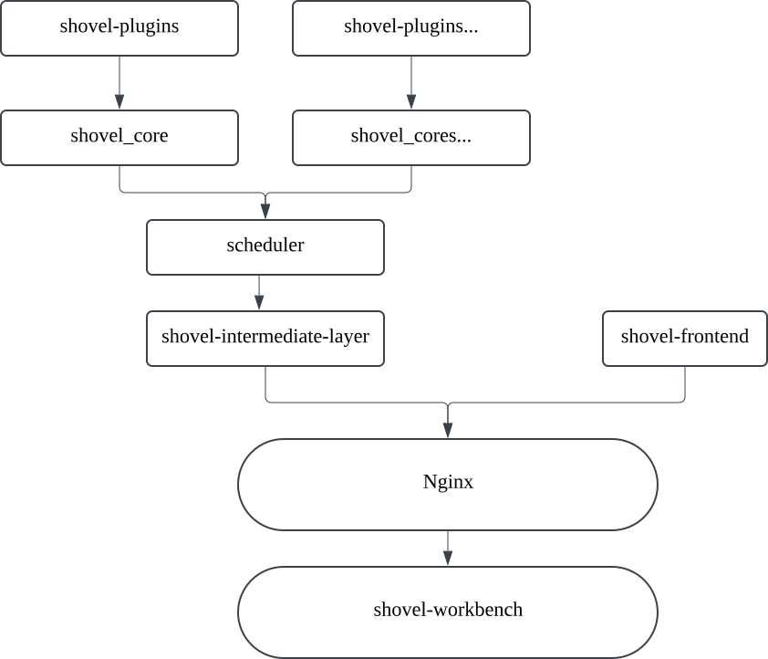

<div align="center">
  <a href="https://www.hscsec.cn">
    
  </a>
  <h1>
    <b>SHOVEL</b>
  </h1>
  

<a href="https://www.hscsec.cn"></a>

<p align="center">
    <a href="#-重新定义企业资产管理范式">🔍 概述</a> •
    <a href="#-快速部署使用">⚡ 快速部署</a> •
    <a href="#-插件生态系统">🧩 插件生态</a> •
    <a href="#-核心文档">💡 核心文档</a>
  </p>


[](https://fastapi.tiangolo.com/)
[](https://www.postgresql.org/)
[](https://nodejs.org/)
[](https://react.dev/)
[](https://ant.design/)
[](https://l7.antv.antgroup.com/)
[](https://nmap.org/)
[](https://github.com/projectdiscovery/httpx)
[](https://nuclei.projectdiscovery.io/)
  <p>
    <sub>
      Powered with ❤️ by
      <a href="https://www.hscsec.cn">
        <b>HSC Security</b>
      </a>
    </sub>
  </p>
</div>


</div>

<div style="background-color:#ffffe0; padding:10px; border:1px solid #ddd;">
  <p style="color:#ff8c00;"><b>⚠️ 免责声明</b></p>
  <p>此项目正在积极开发中。预计新版本会引入突破性变更。更新前请务必查看版本更改日志。</p>
</div>


### 🔍 重新定义企业资产管理范式

**Shovel** 是一款面向现代企业安全团队的开源资产测绘平台。通过融合主被动扫描引擎、多模态数据关联分析和智能风险评估模型，我们致力于解放安全行业重复劳动者的双手、为企业提供更优雅的资产治理解决方案。

### 📕 项目结构

* 项目由`shovel_core`、`shovel-intermediate-layer`、`shovel-frontend`三个子层构成，具体组成如图所示:



* 此项目仅为`shovel_core`的开源代码，`shovel-intermediate-layer`、`shovel-frontend`目前由仓库管理者团队进行运维，如果您对项目有任何建议、议题，欢迎提交[Issue](https://github.com/diamond-shovel/diamond-shovel/issues)，感谢您的建设！

### ⚡ 快速部署使用

#### 一键部署
``` 
curl -o install.sh https://shovel.cyberspike.top/install.sh && bash install.sh
# 验证码需要关注"中龙技术"公众号回复"SHOVEL-ACTIVATE"获取
```

[](./quick-start.md)


### 🧩 插件生态系统

#### 官方基础插件集（持续更新）


| 插件名称                | 功能描述                                                                 | 标签                                                                 |
|-------------------------|--------------------------------------------------------------------------|----------------------------------------------------------------------|
| **fingerprinter**       | 根据任务中的URL信息进行CMS指纹识别                                       | `info-collecting`, `collector`, `discovery`, `identification`, `CMS` |
| **nmapper**             | 根据任务中的Host信息，使用Nmap扫描器进行端口探测并识别服务               | `info-collecting`, `collector`, `network`, `nmap`, `port`, `discovery`, `CIDR` |
| **fofa_mapper**         | 根据任务中的域名信息，使用FOFA进行信息收集                               | `info-collecting`, `collector`, `domain`, `FOFA`                     |
| **http_port_visitor**   | 根据任务中的开放端口信息，进行相关Web服务的信息收集                      | `httpx`, `info-collecting`, `collector`, `ports`, `http`             |
| **company_investigator**| 根据任务中的公司/集团名进行ICP备案信息收集                               | `info-collecting`, `collector`, `company`, `enscan`, `unstable`      |
| **domain_seeker**       | 根据任务中的域名信息，进行子域名信息收集                                 | `info-collecting`, `collector`, `website`, `discovery`, `domain`, `DNS`, `amass` |
| **nuclei_reactor**      | 根据任务中的URL信息，使用Nuclei扫描器进行漏洞检测                        | `vulnerability`, `detection`, `nuclei`, `exploit`, `CVE`             |

* 更多社区插件: 插件商店建设中...


---

### 🌱 欢迎贡献插件（插件商店建设中）

我们鼓励开发者参与插件生态建设：
1. **提交插件**：将你的插件代码提交到我们的插件市场
2. **插件审核**：经过审核后，优质插件将被纳入官方插件库
3. **社区奖励**：贡献者将获得专属荣誉标识和社区积分

---

### 📢 温馨提示

- **插件编写指南**：详细的插件开发Wiki将在近期发布，敬请期待！
- **插件反馈**：如果你对现有插件有任何建议或发现问题，欢迎提交[Issue](https://github.com/diamond-shovel/diamond-shovel/issues)

### 💡 核心文档

以下是 Shovel Core 的核心文档，主要面向插件开发者和需要深入了解 Shovel 内部机制的用户。
**请注意，如果您是普通用户，建议使用[快速部署](./quick-start.md)，无需阅读以下文档。**

*   [简易插件开发指南](docs/plugin-dev.md)
*   [命令行版本安装指南](docs/install.md)
*   [命令行调用手册](docs/cmdline.md)


---

## 🎉 鸣谢

Shovel项目（包含官方插件）开发过程中调用或二次开发了以下项目，在此感谢项目及其作者们！

- https://github.com/owasp-amass/amass
- https://github.com/wgpsec/ENScan_GO
- https://github.com/projectdiscovery/nuclei
- https://github.com/antvis/L7

---
📌 法律声明：本工具仅限合法授权测试使用，开发者不对滥用行为负责<br> 
📧 商务合作：shovel@hscsec.cn | 🌐 团队官网：https://www.hscsec.cn


让我们一起打造更强大的Shovel插件生态！🚀
